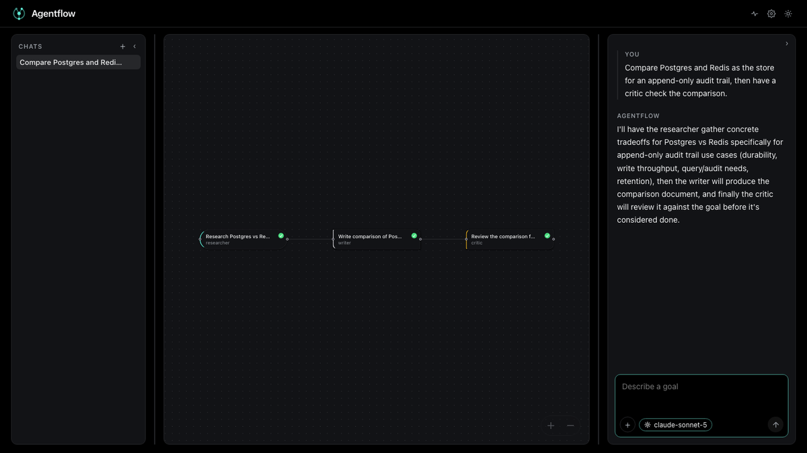
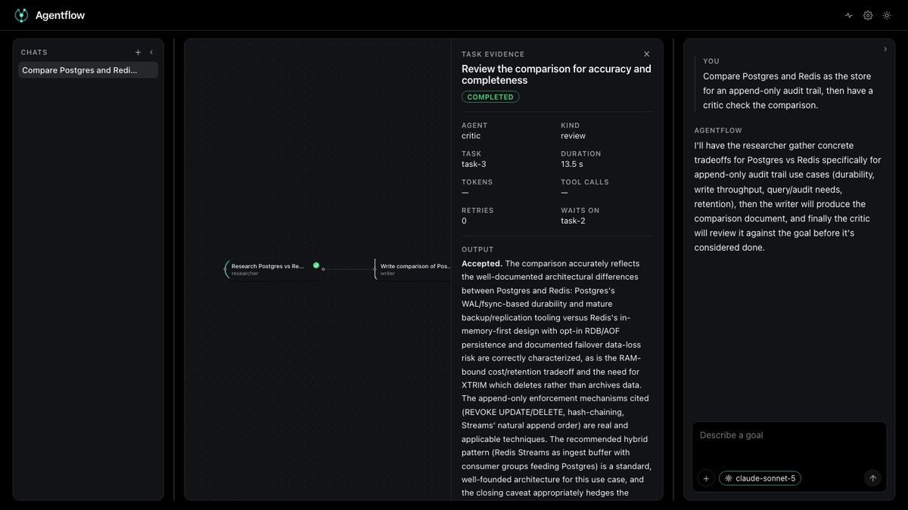
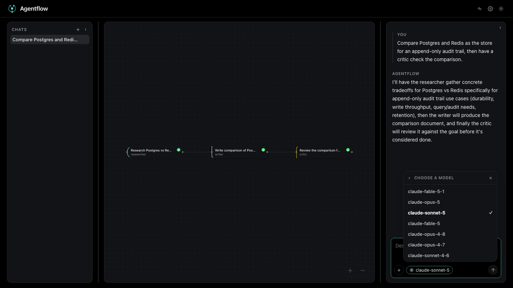

<div align="center">


[](pyproject.toml)
[](apps/api)
[](packages/core)
[](docs/policy-schema.md)
[](infra/)
[](infra/)
[](apps/console/package.json)
[](docker/)
[](LICENSE)

Agentflow turns one goal into a task graph at run time. You describe what you
want and keep chatting; the coordinator reasons about it, weaves a DAG of tasks
assigned to agents, and a deterministic scheduler runs it across the team. The
whole run stays data you can watch node by node, inspect, approve, and replay.


<sub>One goal, typed and sent. The coordinator reasons, plans, and weaves seven
tasks onto the canvas — three researchers in parallel, three writers behind
them, one critic at the end — and the scheduler runs it.</sub>

</div>

## What it looks like

The canvas is the run, not a picture of it. Each node is a task assigned to an
agent, drawn as the species of work it is, carrying the state it is in:

<p align="center">
  
</p>

Open a node for its evidence — the agent, the kind of work, how long it took,
what it waited on, and the agent's own output, streaming in while it is still
being written:

<p align="center">
  
</p>

Pick the model the team reasons through: a provider, its key, then any model
that key can actually reach. Switching model later never asks for the key again:

<p align="center">
  
</p>

## Architecture

```
Console (Next.js) --WebSocket--> API (FastAPI)
                                     |
                         Coordinator (Claude / OpenAI)
                                     |
                            Task DAG, built per goal
                                     |
                        Deterministic wave scheduler
                                     |
              +----------------------+----------------------+
        researcher / executor / writer / critic      governed MCP tools
                                     |
        Audit log (Postgres)   Policy engine (YAML)   Approval queue
```

## Install

Everything runs in Docker. You need Docker Desktop (or Docker Engine with
Compose v2) and nothing else — no local Python or Node.

```bash
git clone https://github.com/abj360/agentflow.git
cd agentflow
cp .env.example .env
docker compose -f docker/docker-compose.yml up --build
```

That brings up four containers: the console on **:3000**, the API on **:8000**,
Postgres on **:5432** and Redis on **:6379**. Database migrations run
automatically when the API container starts. `scripts/run-local.sh` does the
same thing if you prefer a script.

Then open **http://localhost:3000/run/new** and give it a model to think with:
click the model pill under the composer, choose **Claude** or **OpenAI**, paste
an API key, and pick the model you want from the ones that key can actually
reach. The key is verified before it is kept, held in the API process only, and
never written to disk or returned to the browser. To have a deployment come up
already able to reason, set `ANTHROPIC_API_KEY` or `OPENAI_API_KEY` in `.env`
instead.

<details>
<summary>Running it without Docker</summary>

```bash
python -m venv .venv && source .venv/bin/activate
pip install -e ".[dev]"
alembic upgrade head                       # needs Postgres on :5432
uvicorn apps.api.main:app --port 8000

cd apps/console && npm install && npm run dev
```

</details>

## How you use it

1. **Describe a goal** in the chat panel, in plain language, and keep chatting.
2. **The coordinator decides what the turn is.** It answers a question, asks you
   one clarifying question when the goal is genuinely ambiguous, or decomposes
   the goal into a task graph. The shape comes from the goal: one step is one
   node, independent strands become parallel roots, and a chain appears only
   where the work really depends on itself.
3. **Watch it weave.** Nodes appear one at a time on the canvas, each assigned
   to an agent, each carrying a tick, a cross, a turning ring or an `!` for the
   state it is in. Dependency edges fire until the work at their far end
   settles.
4. **Open any node** to read its evidence: the agent, the kind of work, how
   long it took, its dependencies, and the agent's own output — streaming in
   while it is still being written.
5. **Approve what needs it.** A task that writes, sends, deletes or spends is
   planned as `needs_approval`; the scheduler holds it and everything behind it
   until a human decides.
6. **Read the close.** Every run ends with the artifact the team produced and
   the coordinator's candid feedback on it — what it answers, what is thin, and
   what it would do next.
7. **Replay it afterwards** — `GET /{trace_id}` returns the whole run and
   `GET /{trace_id}/verify` proves the hash chain was never tampered with.

## Governance

Tool calls are evaluated against `apps/api/policy/schema.yaml` before execution.
An approval is a state a node is in rather than a queue somewhere else: the
coordinator plans anything that writes, sends, deletes or spends as
`needs_approval`, the scheduler holds that task and everything behind it, and
the node waits on the canvas with an `!` until a human decides. Nothing
downstream runs in the meantime.

The critic works the same way, in the other direction. When it rejects the work
it names what each author has to change, those authors run again with the note
attached, and the critic reviews the result — up to `MAX_REVISIONS` passes,
after which the run reports `revision-bounded` rather than looping forever.

The schema format is documented in `docs/policy-schema.md`.

## Load & chaos testing

```bash
locust -f tests/load/locustfile.py
pytest tests/chaos/
```

## Docs

- `docs/adr/ADR-001-orchestration-pattern.md` — the four-role loop and why it is bounded
- `docs/adr/ADR-002-audit-trace-format.md` — the hash-chained audit event format
- `docs/adr/ADR-002-dynamic-task-graph.md` — why the graph is built per goal at run time
- `docs/policy-schema.md` — the governance policy schema reference

## License

MIT — see [LICENSE](LICENSE). Contributions welcome: see [CONTRIBUTING.md](CONTRIBUTING.md).
