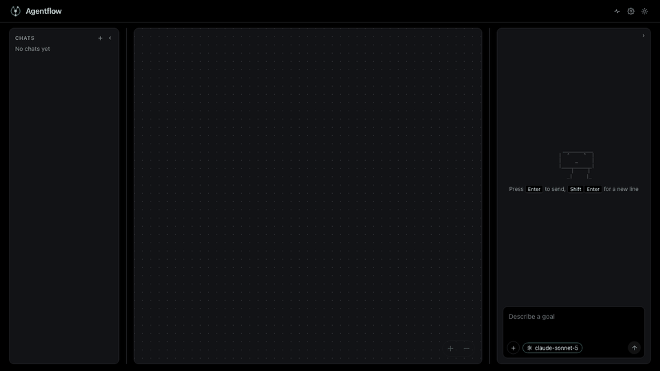
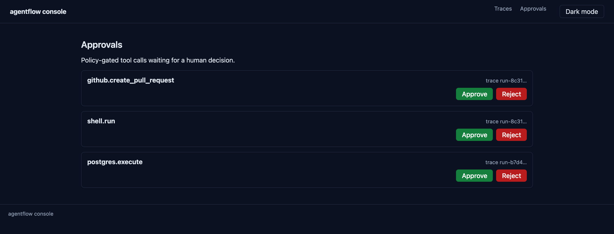

<div align="center">


[](pyproject.toml)
[](apps/api)
[](packages/core)
[](docs/policy-schema.md)
[](infra/)
[](infra/)
[](apps/console/package.json)
[](docker/)
[](LICENSE)

Agentflow is a multi-agent orchestrator that runs a bounded planner, executor,
synthesizer and critic loop over governed MCP tools, routing every high-risk call
to a human approval queue and recording the whole run as a hash-chained audit
trace you can replay.



</div>

## How you use it

1. **Bring the stack up** — `cp .env.example .env`, then
   `docker compose -f docker/docker-compose.yml up --build`.
2. **Declare what the agents may do** — list your tools in
   `apps/api/policy/schema.yaml` and mark which ones a human has to approve.
   The format is documented in `docs/policy-schema.md`.
3. **Start a run** against the API on `:8000`.
4. **Watch it** in the console on `:3000`. The trace streams live over `/ws/traces`:
   planner, executor, synthesizer and critic, each step as it happens.
5. **Approve the risky calls.** A high-risk tool stops the run and appears in the
   approval queue; approve or reject it and the executor carries on.
6. **Replay it afterwards** — `GET /{trace_id}` returns the whole run and
   `GET /{trace_id}/verify` proves the hash chain was never tampered with.

## Architecture

```
Console (Next.js) --WebSocket--> API (FastAPI)
                                    |
                          Orchestration loop (LangGraph)
                                    |
                +-------------------+-------------------+
           Audit log (Postgres)  Policy engine (YAML)  MCP servers
```

## Quickstart (one command, fully dockerized)

```bash
cp .env.example .env
docker compose -f docker/docker-compose.yml up --build
# console on :3000, api on :8000, postgres on :5432, redis on :6379
```

Migrations run automatically on api container startup. No local Python/Node install needed.
Prefer a script? `scripts/run-local.sh` does the same thing.

## Governance

Tool calls are evaluated against `apps/api/policy/schema.yaml` before execution;
high-risk actions route to the approval queue in the console, where a human
approves or rejects each one before the executor may proceed:

<p align="center">
  
</p>

The schema format is documented in `docs/policy-schema.md`.

## Load & chaos testing

```bash
locust -f tests/load/locustfile.py
pytest tests/chaos/
```

## Docs

- `docs/adr/ADR-001-orchestration-pattern.md` — the four-role loop and why it is bounded
- `docs/adr/ADR-002-audit-trace-format.md` — the hash-chained audit event format
- `docs/policy-schema.md` — the governance policy schema reference

## License

MIT — see [LICENSE](LICENSE). Contributions welcome: see [CONTRIBUTING.md](CONTRIBUTING.md).
